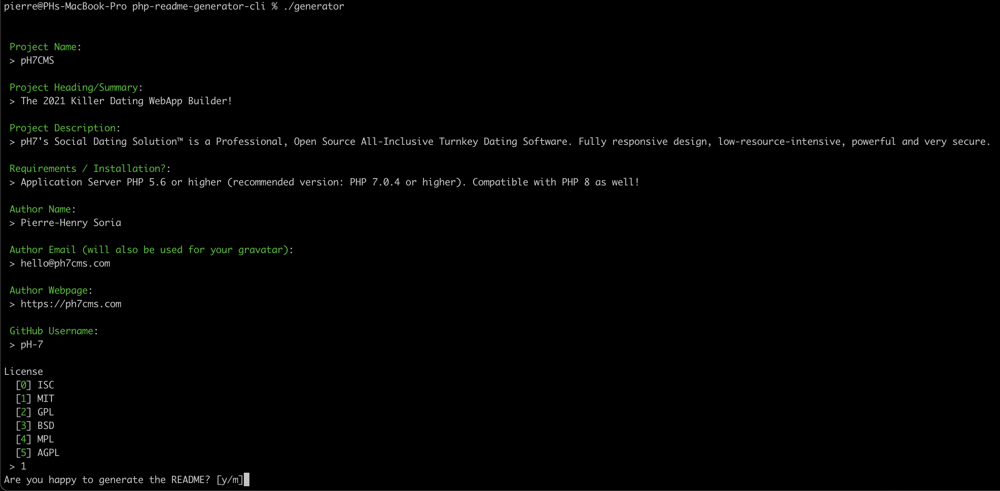

# README Generator 🚀

### Simplest way to generate SEO-optimized GitHub README 

**📄 PHP README File Generator**, to generate easily beautiful (and SEO-friendly) GitHub README files on the fly 🚀

- NEW [v1.2.0](https://github.com/pH-7/github-readme-generator-cli/releases/tag/v1.2.0): Default values are pre-selected from the information already present in the `composer.json` file. 
  > `github-readme-generator` reads `composer.json` info and suggest the default values during the creation of your `README.md` file ✨

## 📙 Requirement

* Make sure you have [PHP 8.0](https://www.php.net/releases/8_0_0.php) or a higher version installed.


## ⚙️ Setup

* Install Composer v2 or higher (https://getcomposer.org)

* Install the dependencies with composer as below

    ```bash
    composer install
    ```

* Update the permissions of the `generate` bash file located in the root directory

    ```
    chmod u+x ./generate
    ```

* Run the script, and follow the instruction shown. Enjoy 😺

    ```bash
    ./generate
    ```





## 🤠 About Me

[](https://ph7.me "Pierre-Henry Soria personal website")

[![@phenrysay][twitter-image]](https://twitter.com/phenrysay) [![pH-7][github-image]](https://github.com/pH-7)

**[Pierre-Henry Soria](https://ph7.me)**, a highly passionate, zen &amp; pragmatic software engineer 😊


You can keep in touch with me at: *hi [AT] pH7 {D0T} me* 📮


## :tv: Video

[](https://www.youtube.com/watch?v=DsJRGl3y0KI)

👉 **[Click here to watch on YouTube](https://www.youtube.com/watch?v=DsJRGl3y0KI)**


## ⚖️ License

This **PHP README Generator CLI script** is generously distributed under the *[MIT](https://opensource.org/licenses/MIT)*.


<!-- GitHub's Markdown reference links -->
[twitter-image]: https://img.shields.io/badge/Twitter-1DA1F2?style=for-the-badge&logo=twitter&logoColor=white
[github-image]: https://img.shields.io/badge/GitHub-100000?style=for-the-badge&logo=github&logoColor=white

<!-- Was generated by https://github.com/pH-7/github-readme-generator-cli/ -->
